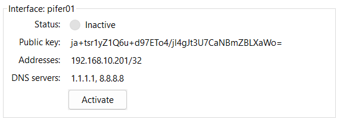

# [**SS2: TOOLS AND ENVIRONMENTS**]()

*Latest update: 2024-10-31.*

***DISCLAIMER:***

* <span style="color: red;">***We are not responsible for any misuse of this document and the tools provided.***</span>

***NOTICE:***

* *This guide is for Windows operating system users. For other operating systems (Linux/Mac OS), please contact the administrator for support.*
* *Please contact the administrator to receive **your account** and **vpn configuration file**.*
* *This is an internal document, please do not share it with others.*
* *This is an internal document, please do not share it with others.*
* *This is an internal document, please do not share it with others.*

## [I. LINUX AND GIT]()

- In this section, you will have to research how to use them yourself. You can refer to the following documents:
  - [Các lệnh cơ bản trong Linux - 35 Linux Commands cần biết](https://www.hostinger.vn/huong-dan/cac-lenh-co-ban-trong-linux)
  - [Introduction to Git](https://videotutorials.notion.site/Introduction-to-Git-ac396a0697704709a12b6a0e545db049)
  - [Từ gà tới pro Git và Github trong 20 phút - Tự học Git siêu tốc](https://www.youtube.com/watch?v=1JuYQgpbrW0)

## [II. SERVER ACCESS GUIDE](https://pifclub.site/setup)

### 2.1. Install & configure Wireguard (skip if you don't need remote external access)

* **WireGuard** is a straightforward VPN solution for secure and fast remote access. It allows you to create a virtual private network (VPN) to access the system from anywhere in the world.

* Download and install: https://www.wireguard.com/install/.

* Import configuration file:

  * Open the *WireGuard* app.

  * From the **Add Tunnel** drop-down *(located at the bottom left of the window)*, select Import tunnel(s) from file... or press **Ctrl+O**.

    

  * Then, select the provided config file.

* Connect to VPN: In the **Tunnels** tab, select the tunnel you just imported and click **Activate**.

  

* Check connection:

  * After connecting, if the **Transfer** section shows received data, it means you have successfully connected.

  * Another way to confirm your connection is by pinging a host. To do this, open *Terminal (or Windows PowerShell)* and running the command below. If you see similar results, your connection is successful.

    ```bash
    Windows PowerShell
    Copyright (C) Microsoft Corporation. All rights reserved.
    
    Install the latest PowerShell for new features and improvements! https://aka.ms/PSWindows
    
    PS C:\Windows\system32> ping eda.pifclub.site
    Pinging eda.pifclub.site [192.168.10.200] with 32 bytes of data:
    Reply from 192.168.10.200: bytes=32 time=2ms TTL=64
    Reply from 192.168.10.200: bytes=32 time=2ms TTL=64
    Reply from 192.168.10.200: bytes=32 time=2ms TTL=64
    Reply from 192.168.10.200: bytes=32 time=2ms TTL=64
    Ping statistics for 192.168.10.200:
    Packets: Sent = 4, Received = 4, Lost = 0 (0% loss),
    Approximate round trip times in milli-seconds:
    Minimum = 2ms, Maximum = 2ms, Average = 2ms
    ```

**NOTE:** 

* *When you are in the lab, please turn off WireGuard when accessing the server to avoid any unwanted errors.*

### 2.2. Change default password (mandatory)

* Run *Terminal (or Windows PowerShell)* on your computer.

* Login into the server via Secure Shell Protocol (SSH):

  ```bash
  $ ssh <your-username>@<hostname>
  ```

  *Example: User named **tlatonf** wants to login to the host **eda.pifclub.site**, so he needs to execute the following command:*

  ```bash
  $ ssh tlatonf@eda.pifclub.site
  ```

* Below is the notification that appears when you connect via SSH to a server that you have never connected to from your device before. Enter ***yes*** to continue.

  ```bash
  The authenticity of host 'eda.pifclub.site (192.168.10.242)' can't be established.
  ECDSA key fingerprint is SHA256:
  Are you sure you want to continue connecting (yes/no/[fingerprint])?
  ```

* Enter your old password *(the password provided to you)*.

  ```bash
  You are required to change your password immediately (root enforced)
  Last failed login: Mon Jan 01 00:00:00 EDT 2024 from 192.168.10.242 on ssh:notty
  There was 1 failed login attempt since the last successful login.
  WARNING: Your password has expired.
  You must change your password now and login again!
  Changing password for user tlatonf.
  Changing password for tlatonf.
  (current) UNIX password:
  ```

* Enter and confirm the new password. If the console screen appears as shown below, it means you have successfully changed your password.

  ```bash
  New password:
  Retype new password:
  passwd: all authentication tokens updated successfully.
  Connection to eda.pifclub.site closed.
  ```

**NOTE:** 

* *At the console screen, it will not display anything as you enter your password.*

### 2.3. Install & configure FileZilla (skip if you don't need to transfer files with the server)

* **FileZilla** is a free and open-source FTP *(File Transfer Protocol)* software used to manage and transfer files between computers and servers.

* Download and install: https://filezilla-project.org/download.php?show_all=1.

* Configure:

  * Run *FileZilla*, it has just been installed.

  * Login with the following information:

    ```
        Host: eda.pifclub.site
    Username: <your-username>
    Password: <your-password>
        Port: 22
    ```

    

* The user transfers files between the server and the computer by drag-and-drop.

**NOTE:** 

* *You should install the **Windows (32-bit x86)** version to minimize unexpected errors.*

### 2.4. Access the server

* Run *Remote Desktop Connection*, it comes pre-installed in Windows.

* In your **Remote Desktop Connection** Options, go to the **Display** tab. Set the color depth of the remote session to **True color (24bit)**.

  

* Login with the following information:

  ```
      Host: eda.pifclub.site
  Username: <your-username>
  Password: <your-password>
  ```

## [III. VIRTUAL MACHINE SETUP GUIDE]()

### 3.1. Preparation

- Download and install [Vmware Workstation Pro 17.5.2](https://softwareupdate.Vmware.com/cds/vmw-desktop/ws/17.5.2/23775571/windows/core/). You can find an activation key [here](https://github.com/hegdepavankumar/Vmware-Workstation-Pro-17-Licence-Keys). *Skip if you have installed it previously.*

- Download and extract the virtual machine [Durian]() containing Cadence Xcelium 20.09 *(it has a size of about 25GB)*. You should refer to the guide before extracting: [How to Extract Multi-Part Archive Files](https://www.toolfarm.com/knowledge-base/licensing/how-to-extract-multi-part-archive-files/).

### 3.2. Guide to Mounting a Shared Folder from Windows to the Virtual Machine *(skip if you don't need to exchange files between them)*

- Open Vmware -> Access `Settings` in the `VM section` on the Menu bar -> Select `Shared Folders Setting` in the `Option tab` -> Click to select `Always enabled` and add a Shared Folder.

  

- Choose the folder in Windows that you want to mount with the virtual machine. The default name of the interface is `Mount`. If you want to change it to a different name, you need to edit the `.bashrc` file located at `~/.bashrc`.

- To proceed with mounting, you just need to execute the command below in the terminal of the virtual machine.

  ```bash
  $ vmhgfs-fuse -o auto_unmount .host:/Mount ~/Mount
  ```

  *Alternatively, you can run the aliased command below:*

  ```bash
  $ mount
  ```

### 3.3. Connect via SSH to the Virtual Machine *(skip if you don't need to use an external editor)*

- Find the IP address of the virtual machine, you can do this by executing the command:

  ```bash
  $ ip -4 addr show ens33 | grep -oP '(?<=inet\s)\d+(\.\d+){3}'
  ```

  

  *You may also follow the instructions in the image below:*

  

- You can use the `Windows Terminal` or `VSCode` to connect via SSH to the virtual machine using the syntax:

  ```bash
  $ ssh <username>@<ip-address>
  ```

  *Example:*

  ```bash
  $ ssh pifer@192.168.127.100
  ```

- If it displays like below, it means you have successfully connected. Now you can `Run Vmware in the background`.

  

**NOTE:** 

- *On each start of Vmware, the `ip-address` may change. You can set a static IP address for convenience in connecting.*

## [IV. RUN THE SAMPLE PROJECT]()

### 4.0. Design Flow

> *(Excerpt from Lab 0 - SystemVerilog, Computer Architecture Courses)*
>
> 
>
> Figure 1 shows the basic design flow of design a digital logic block. In this diagram, designers have to follow four steps:
>
> 1. **RTL Coding** is consisted of designing algorithms, FSMs, etc. to handle the requirements of the problem or expected designs. In this document, you will use SystemVerilog HDL, a versatile HDL for both design and verification.
> 2. **Lint Check** is a process of static code analysis to check the quality of the code. Lint Check will check your code with a list of rules, to find any violations syntax errors or potential code lines or blocks that may cause errors or bugs when running. This step is needed to perform right after you finish RTL Coding. If there are any flags or errors, you need to read them carefully to know exactly the rules you violated to fix your code.
> 3. **Verification** is a process of running your code to check correctness your design. Based on the requirements, each input will have only one expected output, so you have to interpret the log or the waveform generated from this step to fix your design. After fixing your design, don't forget linting again.
> 4. **Implementation** is to implement the design into real hardware. Your simulation and the reality are sometimes not the same.

### 4.1. Execute cloning of the `sample_project`:

```bash
$ cp -r /vault/sample_project/ ~/
```

### 4.2. Run lint-check:

```bash
$ cd ~/sample_project/20_sim/
$ ./linting.sh
```

* There will be a small bug when running `./linting.sh`, please find a way to fix it!

  ```bash
  $ pifer@pifclub:20_sim$ cd ~/sample_project/20_sim/
  $ pifer@pifclub:20_sim$ ./linting.sh
  TOOL:   xrun    20.09-s001: Started on Oct 28, 2024 at 09:12:34 PDT
  TOOL:   xrun(64)        20.09-s001: Started on Oct 28, 2024 at 09:12:34 PDT
  xrun(64): 20.09-s001: (c) Copyright 1995-2020 Cadence Design Systems, Inc.
  file: ../00_src/ic74138.sv
          module worklib.ic74138:sv
                  errors: 0, warnings: 0
                  Caching library 'worklib' ....... Done
          Elaborating the design hierarchy:
          Top level design units:
                  ic74138
  xmelab: *W,DSEMEL: This SystemVerilog design will be simulated as per IEEE 1800-2009 SystemVerilog simulation semantics. Use -disable_sem2009 option for turning off SV 2009 simulation semantics.
          Building instance overlay tables: .................... Done
          Generating native compiled code:
                  worklib.ic74138:sv <0x45550e4d>
                          streams:   1, words:   536
          Building instance specific data structures.
          Loading native compiled code:     .................... Done
          Design hierarchy summary:
                           Instances  Unique
                  Modules:         1       1
                  Registers:       1       1
                  Scalar wires:    3       -
                  Vectored wires:  1       -
                  Always blocks:   1       1
          Writing initial simulation snapshot: worklib.ic74138:sv
  hal(64): 20.09-s001: (c) Copyright 1995-2020 Cadence Design Systems, Inc.
  hal: Options:   -cdslib ./xcelium.d/run.lnx8664.20.09.d/cds.lib -logfile xrun.log -f /home/pifer/sample_project/20_sim/xcelium.d/run.lnx8664.20.09.d/hal.args .
  hal: Snapshot:  worklib.ic74138:sv.
  hal: Workspace: /home/pifer/sample_project/20_sim.
  hal: Date: Mon Oct 28 09:13:07 PDT 2024.
  
  Performing lint checks
  .
  Performing synthesizability checks
  .
  Performing structural checks
  .
  
  Analysis summary :
  
   Warnings : (6)
    CDEFCV (1)      DSEMEL (1)      NOBLKN (1)      STYVAL (2)
    TPOUNR (1)
  
   Notes    : (2)
    NUMDFF (1)      PRTCNT (1)
  
  Analysis complete.
  
  Complete HAL log in : xrun.log
  To analyze results, run following command :
      xmbrowse -64bit -cdslib ./xcelium.d/run.lnx8664.20.09.d/cds.lib -hdlvar ./xcelium.d/run.lnx8664.20.09.d/hdl.var -sortby severity -sortby category -sortby tag xrun.log
  
  TOOL:   xrun(64)        20.09-s001: Exiting on Oct 28, 2024 at 09:15:16 PDT  (total: 00:02:42)
  ```

* According to the results above, the RTL code has **6 warnings** and **2 notes**; the detailed report is saved in the file `xrun.log`:

  ```bash
  $ cat ~/sample_project/20_sim/xrun.log

### 4.3. Run testbench:

```bash
$ cd ~/sample_project/20_sim/
$ ./testbench.sh
```

*Result:*

```bash
pifer@pifclub:20_sim$ ./testbench.sh
TOOL:   xrun    20.09-s001: Started on Oct 28, 2024 at 09:27:13 PDT
TOOL:   xrun(64)        20.09-s001: Started on Oct 28, 2024 at 09:27:13 PDT
xrun(64): 20.09-s001: (c) Copyright 1995-2020 Cadence Design Systems, Inc.
file: ../00_src/ic74138.sv
        module worklib.ic74138:sv
                errors: 0, warnings: 0
file: ../10_tb/ic74138_tb.sv
        module worklib.ic74138_tb:sv
                errors: 0, warnings: 0
                Caching library 'worklib' ....... Done
        Elaborating the design hierarchy:
        Top level design units:
                ic74138_tb
xmelab: *W,DSEMEL: This SystemVerilog design will be simulated as per IEEE 1800-2009 SystemVerilog simulation semantics. Use -disable_sem2009 option for turning off SV 2009 simulation semantics.
        Building instance overlay tables: .................... Done
        Generating native compiled code:
                worklib.ic74138:sv <0x0b9d4e16>
                        streams:   1, words:   613
                worklib.ic74138_tb:sv <0x153068f8>
                        streams:   5, words:  7239
        Building instance specific data structures.
        Loading native compiled code:     .................... Done
        Design hierarchy summary:
                              Instances  Unique
                Modules:              2       2
                Registers:           10      10
                Scalar wires:         3       -
                Vectored wires:       3       -
                Always blocks:        1       1
                Initial blocks:       1       1
                Pseudo assignments:   4       4
        Writing initial simulation snapshot: worklib.ic74138_tb:sv
Loading snapshot worklib.ic74138_tb:sv .................... Done
xmsim: *W,DSEM2009: This SystemVerilog design is simulated as per IEEE 1800-2009 SystemVerilog simulation semantics. Use -disable_sem2009 option for turning off SV 2009 simulation semantics.
xcelium> source /opt/cadence/installs/XCELIUM2009/tools/xcelium/files/xmsimrc
xcelium> run
Testcase # 1  | g1 = x, g2a = 1, g2b = x | decoder = 11111111, decoder_tc = 11111111 | PASSED
Testcase # 2  | g1 = x, g2a = x, g2b = 1 | decoder = 11111111, decoder_tc = 11111111 | PASSED
Testcase # 3  | g1 = 0, g2a = x, g2b = x | decoder = 11111111, decoder_tc = 11111111 | PASSED
Testcase # 4  | g1 = 1, g2a = 0, g2b = 0 | decoder = 11111110, decoder_tc = 11111110 | PASSED
Testcase # 5  | g1 = 1, g2a = 0, g2b = 0 | decoder = 11111101, decoder_tc = 11111101 | PASSED
Testcase # 6  | g1 = 1, g2a = 0, g2b = 0 | decoder = 11111011, decoder_tc = 11111011 | PASSED
Testcase # 7  | g1 = 1, g2a = 0, g2b = 0 | decoder = 11110111, decoder_tc = 11110111 | PASSED
Testcase # 8  | g1 = 1, g2a = 0, g2b = 0 | decoder = 11101111, decoder_tc = 11101111 | PASSED
Testcase # 9  | g1 = 1, g2a = 0, g2b = 0 | decoder = 11011111, decoder_tc = 11011111 | PASSED
Testcase #10  | g1 = 1, g2a = 0, g2b = 0 | decoder = 10111111, decoder_tc = 10111111 | PASSED
Testcase #11  | g1 = 1, g2a = 0, g2b = 0 | decoder = 01111111, decoder_tc = 01111111 | PASSED
Simulation complete via $finish(1) at time 110 NS + 0
../10_tb/ic74138_tb.sv:57     $finish;
xcelium> exit
TOOL:   xrun(64)        20.09-s001: Exiting on Oct 28, 2024 at 09:27:35 PDT  (total: 00:00:22)
```